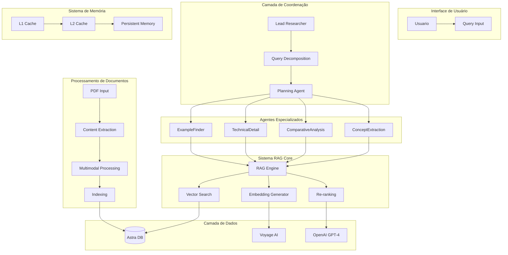

# 🚀 Sistema RAG Multi-Agente Avançado

Um sistema de **Geração Aumentada por Recuperação (RAG)** com arquitetura multi-agente especializada, reasoning avançado e sistema de memória distribuída.

[](https://python.org)
[](https://openai.com)
[](https://voyageai.com)
[](https://astra.datastax.com)

---

## 📋 Índice

- [🎯 Visão Geral](#-visão-geral)
- [🧠 Teoria e Conceitos](#-teoria-e-conceitos)
- [🏗️ Arquitetura do Sistema](#️-arquitetura-do-sistema)
- [⚙️ Instalação e Configuração](#️-instalação-e-configuração)
- [🚀 Guia de Uso](#-guia-de-uso)
- [🔧 Configuração Avançada](#-configuração-avançada)
- [🧪 Exemplos Práticos](#-exemplos-práticos)
- [📊 Performance e Otimização](#-performance-e-otimização)
- [🛠️ Desenvolvimento](#️-desenvolvimento)
- [❓ Troubleshooting](#-troubleshooting)
- [📚 Referências](#-referências)

---

## 🎯 Visão Geral

### O que é este sistema?

Este é um **sistema RAG (Retrieval-Augmented Generation) multi-agente** que combina:

- **🔍 Busca semântica avançada** com embeddings multimodais
- **🤖 Arquitetura multi-agente** com especialização
- **🧠 Reasoning ReAct** (Reason + Act) para tomada de decisão
- **💾 Sistema de memória distribuída** com cache hierárquico
- **📊 Processamento multimodal** (texto + imagem)

### Por que usar este sistema?

**Problemas tradicionais do RAG:**
- ❌ Respostas genéricas e superficiais
- ❌ Falta de especialização por domínio
- ❌ Não considera contexto temporal
- ❌ Limitado a texto apenas
- ❌ Sem capacidade de reasoning complexo

**Soluções deste sistema:**
- ✅ **Agentes especializados** para diferentes tipos de análise
- ✅ **Reasoning avançado** com padrão ReAct
- ✅ **Processamento multimodal** (texto + imagem)
- ✅ **Memória distribuída** com cache inteligente
- ✅ **Configuração flexível** para diferentes casos de uso

---

## 🧠 Teoria e Conceitos

### 1. **RAG (Retrieval-Augmented Generation)**

#### Conceito Base
RAG é uma técnica que combina:
1. **Retrieval (Recuperação)**: Busca informações relevantes em uma base de dados
2. **Augmentation (Aumento)**: Enriquece o prompt com informações encontradas
3. **Generation (Geração)**: LLM gera resposta baseada no contexto aumentado

#### Pipeline RAG Tradicional
```
Query → Embedding → Busca Vetorial → Contexto → LLM → Resposta
```

#### Pipeline RAG Avançado (Este Sistema)
```
Query → Análise → Decomposição → Multi-Agentes → Reasoning → Síntese → Resposta
   ↓       ↓          ↓            ↓             ↓         ↓         ↓
Cache → Embedding → Subqueries → Especialização → ReAct → Validação → Output
```

### 2. **Arquitetura Multi-Agente**

#### Conceito de Agentes
Um **agente** é uma entidade autônoma que:
- 🎯 Tem um **objetivo específico**
- 🧠 Pode **tomar decisões**
- 🔄 **Interage** com outros agentes
- 📊 **Aprende** com experiências

#### Tipos de Agentes no Sistema

**🎯 Lead Researcher (Coordenador Principal)**
- Recebe a query do usuário
- Analisa complexidade e contexto
- Decompõe em subtarefas
- Coordena agentes especializados
- Sintetiza resultados finais

**🔍 Subagentes Especializados**
- **ConceptExtraction**: Foca em definições e conceitos
- **ComparativeAnalysis**: Especializado em comparações
- **TechnicalDetail**: Detalha aspectos técnicos
- **ExampleFinder**: Busca exemplos práticos

#### Vantagens da Abordagem Multi-Agente
- **Especialização**: Cada agente é expert em seu domínio
- **Paralelismo**: Múltiplas análises simultâneas
- **Qualidade**: Análise mais profunda e abrangente
- **Escalabilidade**: Fácil adição de novos especialistas

### 3. **ReAct Reasoning Pattern**

#### O que é ReAct?
ReAct = **Reason** (Raciocinar) + **Act** (Agir)

É um padrão onde o sistema:
1. **Thought**: Analisa a situação atual
2. **Action**: Executa uma ação específica
3. **Observation**: Observa o resultado
4. **Repeat**: Repete até atingir o objetivo

#### Exemplo de Ciclo ReAct
```
Thought: "Preciso entender o que é Zep. Vou buscar definições."
Action: Buscar("definição Zep arquitetura")
Observation: "Encontrei 5 documentos sobre Zep..."
Thought: "Bom, mas preciso de mais detalhes técnicos."
Action: Buscar("Zep implementação técnica detalhes")
Observation: "Encontrei informações sobre implementação..."
Thought: "Agora tenho informações suficientes para responder."
Action: Sintetizar resposta completa
```

#### Benefícios do ReAct
- **Transparência**: Cada passo é explicado
- **Adaptabilidade**: Ajusta estratégia conforme necessário
- **Robustez**: Recupera de erros e tentativas falhas
- **Aprendizado**: Melhora com experiência

### 4. **Sistema de Memória Distribuída**

#### Hierarquia de Cache
```
L1 Cache (Rápido, Pequeno)
    ↓
L2 Cache (Médio, Médio)  
    ↓
Banco Vetorial (Lento, Grande)
    ↓
Documentos Originais
```

#### Tipos de Memória
- **Episódica**: Lembra de interações específicas
- **Semântica**: Conhecimento conceitual
- **Procedural**: Como fazer tarefas
- **Working Memory**: Contexto atual da sessão

### 5. **Embeddings Multimodais**

#### O que são Embeddings?
Embeddings são **representações vetoriais** que capturam:
- Significado semântico
- Relações entre conceitos
- Similaridade contextual

#### Multimodalidade
Este sistema processa:
- **📝 Texto**: Markdown extraído de PDFs
- **🖼️ Imagens**: Figuras, diagramas, tabelas
- **🔗 Relações**: Conexões entre texto e imagem

#### Vantagens dos Embeddings Multimodais
- **Compreensão completa**: Não perde informação visual
- **Busca avançada**: Encontra informações em qualquer modalidade
- **Contexto rico**: Combina informações textuais e visuais

---

## 🏗️ Arquitetura do Sistema

### Visão Geral da Arquitetura



### Componentes Principais

#### 1. **Sistema RAG Core** (`search.py`)
**Responsabilidades:**
- Pipeline principal de busca
- Geração de embeddings
- Busca por similaridade
- Re-ranking de resultados
- Geração de respostas

**Fluxo de Execução:**
1. **Query Analysis**: Analisa e transforma a query
2. **Embedding Generation**: Gera embedding da query
3. **Similarity Search**: Busca candidatos no banco vetorial
4. **Re-ranking**: Classifica candidatos por relevância
5. **Relevance Check**: Verifica se resultados são relevantes
6. **Answer Generation**: Gera resposta final

**Tecnologias:**
- Voyage AI para embeddings
- Astra DB para busca vetorial
- OpenAI GPT-4 para re-ranking e geração

#### 2. **Sistema Multi-Agente** (`multi-agent-researcher/`)
**Responsabilidades:**
- Coordenação de agentes
- Decomposição de queries
- Reasoning ReAct
- Síntese de resultados

**Agentes Implementados:**

**🎯 OpenAI Lead Researcher**
```python
class OpenAILeadResearcher:
    """Coordenador principal usando OpenAI GPT-4"""
    
    def research(self, query: str) -> AgentResult:
        # 1. Análise da query
        complexity = self.analyze_complexity(query)
        
        # 2. Decomposição inteligente
        if complexity.requires_decomposition:
            subqueries = self.decompose_query(query)
            
            # 3. Execução paralela de subagentes
            results = await self.execute_subagents(subqueries)
            
            # 4. Síntese final
            return self.synthesize_results(results)
        else:
            # Execução direta para queries simples
            return await self.direct_research(query)
```

**🔍 RAG Research Subagent**
```python
class RAGResearchSubagent:
    """Subagente especializado em busca RAG"""
    
    def __init__(self, specialist_type: SpecialistType):
        self.type = specialist_type  # ConceptExtraction, etc.
        self.rag_tool = OptimizedRAGSearchTool()
        
    async def research(self, query: str) -> SubagentResult:
        # Busca especializada baseada no tipo
        specialized_query = self.adapt_query_for_specialty(query)
        return await self.rag_tool.search(specialized_query)
```

#### 3. **Processamento de Documentos** (`indexer.py`)
**Responsabilidades:**
- Download e extração de PDFs
- Processamento multimodal
- Geração de embeddings
- Indexação no banco vetorial

**Pipeline de Indexação:**
1. **PDF Download**: Download seguro com retry
2. **Content Extraction**: Extrai texto (Markdown) e imagens
3. **Multimodal Processing**: Processa texto + imagem juntos
4. **Embedding Generation**: Gera embeddings multimodais
5. **Vector Indexing**: Armazena no Astra DB

**Exemplo de Documento Processado:**
```json
{
    "id": "doc_page_1",
    "page_num": 1,
    "markdown_text": "# Zep Architecture\n\nZep é um sistema...",
    "image_path": "pdf_images/doc_page_1.png",
    "embedding": [0.1, 0.2, ...],  // 1024 dimensões
    "doc_source": "zep_paper",
    "metadata": {
        "tokens_text": 150,
        "tokens_image": 300,
        "total_tokens": 450
    }
}
```

#### 4. **Sistema de Configuração**
**Arquitetura Flexível:**
```
constants.py → Valores padrão organizados
     ↓
config.py → Classes de configuração com validação
     ↓
.env → Configurações específicas do ambiente
     ↓
Sistema → Configuração centralizada e validada
```

**Benefícios:**
- **Flexibilidade**: Configuração por ambiente
- **Validação**: Detecta configurações inválidas
- **Documentação**: Todas as opções documentadas
- **Defaults**: Valores sensatos para começar

### Fluxo de Dados Completo

#### 1. **Indexação (Preparação)**
```
PDF → Extração → Processamento → Embeddings → Banco Vetorial
 ↓       ↓           ↓             ↓            ↓
URL → Markdown + PNG → Multimodal → Voyage AI → Astra DB
```

#### 2. **Query Processing (Execução)**
```
Query do Usuário
       ↓
Lead Researcher (Análise)
       ↓
Decomposição LLM
       ↓
Subagentes Paralelos
   ↓   ↓   ↓   ↓
  RAG RAG RAG RAG
       ↓
Síntese e Reasoning
       ↓
Resposta Final
```

#### 3. **RAG Pipeline Detalhado**
```
Subquery → Transform → Embedding → Search → Re-rank → Generate
    ↓         ↓          ↓          ↓        ↓         ↓
"Zep def" → "What is" → [0.1,0.2] → 5 docs → 2 best → Answer
```

---

## ⚙️ Instalação e Configuração

### Pré-requisitos

#### Software Necessário
- **Python 3.8+** 
- **Git**
- **pip** (gerenciador de pacotes Python)

#### Contas e APIs Necessárias
1. **OpenAI** - Para GPT-4 (geração e re-ranking)
   - Crie conta em: https://platform.openai.com
   - Gere API key em: https://platform.openai.com/api-keys

2. **Voyage AI** - Para embeddings multimodais
   - Crie conta em: https://www.voyageai.com
   - Obtenha API key no dashboard

3. **DataStax Astra DB** - Para banco vetorial
   - Crie conta em: https://astra.datastax.com
   - Crie um database vetorial
   - Gere application token

### Instalação Passo a Passo

#### 1. **Clone o Repositório**
```bash
git clone <seu-repositorio>
cd rag
```

#### 2. **Crie Ambiente Virtual**
```bash
# Criar ambiente virtual
python -m venv venv

# Ativar (Linux/Mac)
source venv/bin/activate

# Ativar (Windows)
venv\Scripts\activate
```

#### 3. **Instale Dependências**
```bash
# Dependências principais
pip install -r requirements.txt

# Se não existe requirements.txt, instalar manualmente:
pip install openai voyageai astrapy pymupdf pymupdf4llm python-dotenv
pip install pydantic tqdm pillow asyncio instructor
```

#### 4. **Configuração de APIs**

**Copie o arquivo de exemplo:**
```bash
cp .env.example .env
```

**Edite o arquivo `.env`:**
```env
# =============================================================================
# APIS OBRIGATÓRIAS
# =============================================================================

# OpenAI API (Obrigatória)
OPENAI_API_KEY=sk-sua_chave_openai_aqui

# Voyage AI API (Obrigatória)
VOYAGE_API_KEY=pa-sua_chave_voyage_aqui

# Astra DB (Obrigatório)
ASTRA_DB_API_ENDPOINT=https://seu-db-id-regiao.apps.astra.datastax.com
ASTRA_DB_APPLICATION_TOKEN=AstraCS:sua_token_aqui

# =============================================================================
# CONFIGURAÇÕES OPCIONAIS (valores padrão serão usados se não definidos)
# =============================================================================

# Modelos
RAG_LLM_MODEL=gpt-4o-2024-11-20
MULTIAGENT_MODEL=gpt-4o-mini-2024-07-18
RAG_EMBEDDING_MODEL=voyage-3

# Performance
MAX_CANDIDATES=5
MAX_SUBAGENTS=3
SUBAGENT_TIMEOUT=180.0

# Cache
EMBEDDING_CACHE_SIZE=500
EMBEDDING_CACHE_TTL=3600
```

#### 5. **Configuração do Astra DB**

**Passos detalhados:**

1. **Acesse** https://astra.datastax.com
2. **Crie nova conta** ou faça login
3. **Create Database**:
   - Database name: `rag-database`
   - Keyspace: `default_keyspace`
   - Provider: `AWS` ou `GCP`
   - Region: Escolha a mais próxima
4. **Aguarde criação** (2-3 minutos)
5. **Copie informações**:
   - API Endpoint: Na aba "Connect"
   - Application Token: Gere em "Settings > Application Tokens"

#### 6. **Teste da Instalação**
```bash
# Teste rápido de configuração
python -c "
from config import SystemConfig
config = SystemConfig()
validation = config.validate_all()
print('✅ Configuração OK!' if validation['rag_valid'] else '❌ Erro na configuração')
"
```

### Configuração Avançada

#### Estrutura de Diretórios
```
rag/
├── 📁 multi-agent-researcher/    # Sistema multi-agente
│   └── src/researcher/
│       ├── agents/              # Agentes especializados
│       ├── tools/               # Ferramentas RAG
│       ├── memory/              # Sistema de memória
│       └── reasoning/           # ReAct reasoning
├── 📁 utils/                    # Utilitários
│   ├── cache.py                # Sistema de cache
│   ├── metrics.py              # Métricas de performance
│   └── validation.py           # Validação de dados
├── 📁 pdf_images/              # Imagens extraídas (auto-criado)
├── 📄 search.py                # Sistema RAG principal
├── 📄 indexer.py               # Processamento de documentos
├── 📄 config.py                # Configuração centralizada
├── 📄 constants.py             # Constantes e defaults
├── 📄 .env                     # Suas configurações
└── 📄 README.md                # Este arquivo
```

---

## 🚀 Guia de Uso

### Uso Básico

#### 1. **Indexar Documentos**

**Indexar PDF da web:**
```bash
# Indexar PDF padrão (configurado no .env)
python indexer.py

# Indexar PDF específico
DEFAULT_PDF_URL=https://arxiv.org/pdf/2501.13956 python indexer.py
```

**Indexar arquivo local:**
```bash
# Copie seu PDF para o diretório
cp meu_documento.pdf .

# Configure para usar arquivo local
DEFAULT_PDF_URL=meu_documento.pdf python indexer.py
```

**Processo de indexação:**
```
📥 Download/Carregamento do PDF
  ↓
📄 Extração de texto (Markdown) + 🖼️ imagens
  ↓
🧮 Geração de embeddings multimodais (Voyage AI)
  ↓
💾 Armazenamento no banco vetorial (Astra DB)
  ↓
✅ Pronto para busca!
```

#### 2. **Busca RAG Simples**

**Teste rápido:**
```python
# teste_busca.py
from search import RAGSearcher

# Inicializar buscador
rag = RAGSearcher()

# Fazer pergunta
resultado = rag.search("O que é Zep e como funciona?")

print("🔍 Resposta:")
print(resultado["answer"])

print(f"\n📊 Estatísticas:")
print(f"• Candidatos encontrados: {resultado['candidates_found']}")
print(f"• Páginas selecionadas: {resultado['pages_selected']}")
print(f"• Tempo total: {resultado['total_time']:.2f}s")
```

**Executar:**
```bash
python teste_busca.py
```

#### 3. **Sistema Multi-Agente**

**Pesquisa coordenada:**
```python
# teste_multiagente.py
import asyncio
import sys
sys.path.append('multi-agent-researcher/src')

from researcher.agents.openai_lead_researcher import OpenAILeadResearcher

async def pesquisa_coordenada():
    # Inicializar coordenador
    lead = OpenAILeadResearcher()
    
    # Fazer pesquisa complexa
    resultado = await lead.research(
        query="Compare Zep com MemGPT e explique as vantagens de cada um",
        objective="Análise comparativa detalhada"
    )
    
    print("🤖 Resultado da Pesquisa Multi-Agente:")
    print(resultado.content)
    
    print(f"\n📊 Estatísticas:")
    print(f"• Agentes executados: {len(resultado.context.get('subagent_results', []))}")
    print(f"• Tempo de execução: {resultado.execution_time:.2f}s")
    print(f"• Status: {resultado.state}")

# Executar
asyncio.run(pesquisa_coordenada())
```

### Casos de Uso Comuns

#### 1. **Análise de Documentos Técnicos**

**Cenário:** Analisar papers acadêmicos, documentação técnica, manuais.

```python
# analise_tecnica.py
from search import RAGSearcher

rag = RAGSearcher()

# Perguntas técnicas específicas
perguntas = [
    "Qual é a arquitetura principal do sistema apresentado?",
    "Quais são as limitações identificadas?",
    "Como o sistema se compara com soluções existentes?",
    "Quais são os resultados experimentais?",
    "Quais trabalhos futuros são sugeridos?"
]

for pergunta in perguntas:
    print(f"\n❓ {pergunta}")
    resultado = rag.search(pergunta)
    print(f"💬 {resultado['answer'][:200]}...")
```

#### 2. **Pesquisa Exploratória**

**Cenário:** Explorar um tópico novo, entender conceitos, buscar exemplos.

```python
# pesquisa_exploratoria.py
import asyncio
import sys
sys.path.append('multi-agent-researcher/src')

from researcher.agents.openai_lead_researcher import OpenAILeadResearcher

async def explorar_topico(topico):
    lead = OpenAILeadResearcher()
    
    # Pesquisa abrangente
    resultado = await lead.research(
        query=f"Explique {topico} de forma abrangente",
        objective=f"Compreensão completa de {topico}"
    )
    
    return resultado

# Exemplo de uso
topico = "sistemas de memória para agentes de IA"
resultado = asyncio.run(explorar_topico(topico))
print(resultado.content)
```

#### 3. **Configurações por Caso de Uso**

**Para Papers Acadêmicos:**
```env
# .env - Configuração para papers
RAG_LLM_MODEL=gpt-4o-2024-11-20                  # Melhor qualidade
MAX_CANDIDATES=10                     # Mais candidatos
MAX_TOKENS_ANSWER=3000               # Respostas mais longas
SUBAGENT_TIMEOUT=300.0               # Timeout maior
MAX_SUBAGENTS=4                      # Mais especialização
```

**Para Documentação Técnica:**
```env
# .env - Configuração para docs
RAG_LLM_MODEL=gpt-4o-mini-2024-07-18            # Rapidez vs qualidade
MAX_CANDIDATES=5                     # Equilíbrio
MAX_TOKENS_ANSWER=1500               # Respostas concisas
PROCESSING_CONCURRENCY=8             # Processamento rápido
```

---

## 🔧 Configuração Avançada

### Sistema de Configuração

#### Hierarquia de Configuração
```
1. Valores padrão (constants.py)
   ↓
2. Arquivo .env (configurações locais)
   ↓  
3. Variáveis de ambiente (override)
   ↓
4. Configuração programática (override)
```

#### Configuração Programática

```python
# config_custom.py
from config import SystemConfig

# Criar configuração personalizada
config = SystemConfig()

# Modificar configurações em runtime
config.rag.max_candidates = 15
config.multiagent.max_subagents = 5
config.rag.llm_model = "gpt-4o-2024-11-20"

# Validar configuração
validation = config.validate_all()
if not validation["rag_valid"]:
    print("❌ Configuração RAG inválida")
    print(validation["rag_errors"])

# Usar configuração customizada
from search import RAGSearcher
rag = RAGSearcher(config=config)
```

### Configurações de Performance

#### High Performance (Velocidade)
```env
# .env - Configuração de alta velocidade
RAG_LLM_MODEL=gpt-4o-mini-2024-07-18
MAX_CANDIDATES=3
MAX_TOKENS_ANSWER=1000
PROCESSING_CONCURRENCY=15
EMBEDDING_CACHE_SIZE=2000
RESPONSE_CACHE_SIZE=500
PARALLEL_EXECUTION=true
```

#### High Quality (Qualidade)
```env
# .env - Configuração de alta qualidade
RAG_LLM_MODEL=gpt-4o-2024-11-20
MAX_CANDIDATES=15
MAX_TOKENS_ANSWER=4000
MAX_SUBAGENTS=5
SUBAGENT_TIMEOUT=300.0
SIMILARITY_THRESHOLD=0.8
```

---

## 🧪 Exemplos Práticos

### Exemplo 1: Sistema de Q&A Técnico

```python
# qa_tecnico.py
"""Sistema de Q&A para documentação técnica"""

from search import RAGSearcher
from typing import Dict

class QATecnico:
    def __init__(self):
        self.rag = RAGSearcher()
        self.historico = []
    
    def fazer_pergunta(self, pergunta: str) -> Dict:
        """Faz uma pergunta técnica e retorna resposta estruturada"""
        
        print(f"❓ Pergunta: {pergunta}")
        
        # Busca RAG
        resultado = self.rag.search(pergunta)
        
        # Estruturar resposta
        resposta_estruturada = {
            "pergunta": pergunta,
            "resposta": resultado["answer"],
            "confianca": self._calcular_confianca(resultado),
            "fontes": resultado.get("sources", []),
            "tempo_resposta": resultado["total_time"],
            "paginas_consultadas": resultado["pages_selected"]
        }
        
        # Adicionar ao histórico
        self.historico.append(resposta_estruturada)
        
        return resposta_estruturada
    
    def _calcular_confianca(self, resultado: Dict) -> float:
        """Calcula nível de confiança da resposta"""
        
        fatores = []
        
        # Número de páginas encontradas
        if resultado["candidates_found"] >= 5:
            fatores.append(0.3)
        elif resultado["candidates_found"] >= 3:
            fatores.append(0.2)
        else:
            fatores.append(0.1)
        
        # Páginas selecionadas após re-ranking
        if resultado["pages_selected"] >= 2:
            fatores.append(0.4)
        else:
            fatores.append(0.2)
        
        # Relevância confirmada
        if resultado.get("relevance_confirmed", False):
            fatores.append(0.3)
        else:
            fatores.append(0.1)
        
        return sum(fatores)
    
    def sessao_qa(self):
        """Sessão interativa de perguntas e respostas"""
        
        print("🤖 Sistema Q&A Técnico Iniciado")
        print("Digite 'sair' para terminar\n")
        
        while True:
            pergunta = input("❓ Sua pergunta: ").strip()
            
            if pergunta.lower() in ['sair', 'exit', 'quit']:
                break
            
            if not pergunta:
                continue
            
            # Processar pergunta
            resposta = self.fazer_pergunta(pergunta)
            
            # Mostrar resposta
            print(f"\n💬 Resposta:")
            print(resposta["resposta"])
            print(f"\n📊 Confiança: {resposta['confianca']:.1%}")
            print(f"⏱️  Tempo: {resposta['tempo_resposta']:.2f}s")
            print("-" * 50)
        
        # Relatório final
        self.gerar_relatorio()
    
    def gerar_relatorio(self):
        """Gera relatório da sessão"""
        
        if not self.historico:
            return
        
        print(f"\n📋 Relatório da Sessão")
        print(f"• Total de perguntas: {len(self.historico)}")
        
        tempo_total = sum(q["tempo_resposta"] for q in self.historico)
        print(f"• Tempo total: {tempo_total:.2f}s")
        
        confianca_media = sum(q["confianca"] for q in self.historico) / len(self.historico)
        print(f"• Confiança média: {confianca_media:.1%}")

# Uso do sistema
if __name__ == "__main__":
    qa = QATecnico()
    qa.sessao_qa()
```

### Exemplo 2: Análise Comparativa Automática

```python
# analise_comparativa.py
"""Sistema de análise comparativa automática"""

import asyncio
import sys
sys.path.append('multi-agent-researcher/src')

from researcher.agents.openai_lead_researcher import OpenAILeadResearcher
from typing import List, Dict

class AnalisadorComparativo:
    def __init__(self):
        self.lead_researcher = OpenAILeadResearcher()
    
    async def comparar_conceitos(self, conceito1: str, conceito2: str) -> Dict:
        """Faz análise comparativa detalhada entre dois conceitos"""
        
        print(f"🔍 Iniciando análise comparativa:")
        print(f"   📊 {conceito1} vs {conceito2}")
        
        # Query estruturada para comparação
        query = f"""
        Faça uma análise comparativa detalhada entre {conceito1} e {conceito2}.
        
        Inclua:
        1. Definição clara de cada conceito
        2. Principais características de cada um
        3. Vantagens e desvantagens
        4. Casos de uso apropriados
        5. Performance e eficiência
        6. Complexidade de implementação
        7. Recomendações de quando usar cada um
        """
        
        # Executar análise multi-agente
        resultado = await self.lead_researcher.research(
            query=query,
            objective=f"Análise comparativa: {conceito1} vs {conceito2}"
        )
        
        # Estruturar resultado
        analise = {
            "conceito1": conceito1,
            "conceito2": conceito2,
            "analise_completa": resultado.content,
            "agentes_executados": len(resultado.context.get("subagent_results", [])),
            "tempo_execucao": resultado.execution_time,
            "status": resultado.state.value,
            "timestamp": resultado.timestamp
        }
        
        return analise

# Exemplo de uso
async def exemplo_comparacao():
    analisador = AnalisadorComparativo()
    
    resultado = await analisador.comparar_conceitos("RAG", "Fine-tuning")
    
    print("\n📋 Resultado da Comparação:")
    print(resultado["analise_completa"])

if __name__ == "__main__":
    asyncio.run(exemplo_comparacao())
```

---

## 📊 Performance e Otimização

### Métricas de Performance

| Métrica | Descrição | Meta |
|---------|-----------|------|
| **Response Time** | Tempo total para responder uma query | < 30s |
| **Cache Hit Rate** | % de queries atendidas pelo cache | > 70% |
| **Accuracy** | Relevância das respostas geradas | > 85% |
| **Throughput** | Queries processadas por minuto | > 2 QPM |
| **Uptime** | Disponibilidade do sistema | > 99% |

### Configurações de Performance

#### Para Velocidade Máxima:
```env
RAG_LLM_MODEL=gpt-4o-mini-2024-07-18            # Modelo mais rápido
MAX_CANDIDATES=3                     # Menos candidatos
MAX_TOKENS_ANSWER=1000              # Respostas mais curtas
EMBEDDING_CACHE_SIZE=2000           # Cache maior
PROCESSING_CONCURRENCY=10           # Alta concorrência
```

#### Para Qualidade Máxima:
```env
RAG_LLM_MODEL=gpt-4o-2024-11-20                # Melhor modelo
MAX_CANDIDATES=20                   # Mais candidatos
MAX_TOKENS_ANSWER=4000             # Respostas completas
MAX_SUBAGENTS=5                    # Mais especialização
SIMILARITY_THRESHOLD=0.8           # Threshold rigoroso
```

---

## 🛠️ Desenvolvimento

### Estrutura do Código

#### Arquivos Principais
```
/workspaces/rag/
├── search.py                 # 🔍 Sistema RAG principal
├── indexer.py               # 📄 Processamento de documentos  
├── config.py                # ⚙️ Configuração centralizada
├── constants.py             # 📊 Constantes e defaults
├── main_multiagent.py       # 🤖 Interface multi-agente
└── utils/                   # 🛠️ Utilitários
    ├── cache.py            # 💾 Sistema de cache
    ├── metrics.py          # 📊 Métricas
    ├── validation.py       # ✅ Validação
    └── resource_manager.py # 🗂️ Gerenciamento recursos
```

### Adicionando Novos Agentes

#### 1. Criar Novo Agente Especializado

```python
# researcher/agents/meu_novo_agente.py
from .enhanced_rag_subagent import EnhancedRAGSubagent, SpecialistType

class MeuNovoAgente(EnhancedRAGSubagent):
    """Agente especializado em [sua especialidade]"""
    
    def __init__(self):
        super().__init__(
            specialist_type=SpecialistType.CUSTOM,
            description="Especialista em [área específica]"
        )
    
    def adapt_query_for_specialty(self, query: str) -> str:
        """Adapta query para esta especialidade"""
        
        specialized_query = f"""
        Como especialista em [sua área], analise:
        {query}
        
        Foque em:
        - [Aspecto 1]
        - [Aspecto 2] 
        - [Aspecto 3]
        """
        
        return specialized_query
```

#### 2. Registrar no Sistema

```python
# researcher/agents/__init__.py
from .meu_novo_agente import MeuNovoAgente

AGENT_REGISTRY = {
    "concept_extraction": ConceptExtractionAgent,
    "comparative_analysis": ComparativeAnalysisAgent,
    "technical_detail": TechnicalDetailAgent,
    "example_finder": ExampleFinderAgent,
    "meu_novo_agente": MeuNovoAgente,  # Novo agente
}
```

### Testes Automatizados

```python
# tests/test_rag_system.py
import pytest
from search import RAGSearcher

class TestRAGSystem:
    def test_rag_initialization(self):
        """Testa inicialização do RAG"""
        rag = RAGSearcher()
        assert rag is not None
        assert hasattr(rag, 'search')
    
    def test_search_functionality(self):
        """Testa funcionalidade de busca"""
        rag = RAGSearcher()
        resultado = rag.search("teste de conectividade")
        
        assert resultado is not None
        assert "answer" in resultado
        assert isinstance(resultado["total_time"], float)

# Executar testes
if __name__ == "__main__":
    pytest.main([__file__, "-v"])
```

---

## ❓ Troubleshooting

### Problemas Comuns

#### 1. **Erro de Conexão com APIs**

**Sintomas:**
- "API key not found"
- "Connection timeout"
- "Rate limit exceeded"

**Soluções:**
```bash
# Verificar variáveis de ambiente
echo $OPENAI_API_KEY
echo $VOYAGE_API_KEY

# Testar conectividade
python -c "
import openai
client = openai.OpenAI()
try:
    response = client.models.list()
    print('✅ OpenAI conectado')
except Exception as e:
    print(f'❌ Erro OpenAI: {e}')
"
```

#### 2. **Problemas de Performance**

**Sintomas:**
- Respostas muito lentas (>60s)
- Alto uso de memória
- Timeouts frequentes

**Diagnóstico:**
```python
# Monitor de performance
from utils.metrics import ProcessingMetrics
import psutil

# Verificar uso de memória
process = psutil.Process()
memory_mb = process.memory_info().rss / 1024 / 1024
print(f"Uso de memória: {memory_mb:.1f} MB")

# Verificar configurações
from config import SystemConfig
config = SystemConfig()
validation = config.validate_all()
print(f"Configuração válida: {validation}")
```

### Script de Diagnóstico

```python
# diagnostico.py
"""Script de diagnóstico completo do sistema"""

import os
import sys
from datetime import datetime

def verificar_ambiente():
    """Verifica configuração do ambiente"""
    
    print("🔍 DIAGNÓSTICO DO AMBIENTE")
    print("=" * 40)
    
    # Python version
    print(f"🐍 Python: {sys.version}")
    
    # Variáveis de ambiente
    vars_necessarias = [
        "OPENAI_API_KEY",
        "VOYAGE_API_KEY", 
        "ASTRA_DB_API_ENDPOINT",
        "ASTRA_DB_APPLICATION_TOKEN"
    ]
    
    for var in vars_necessarias:
        valor = os.getenv(var)
        status = "✅" if valor else "❌"
        valor_exibido = valor[:10] + "..." if valor else "Não definida"
        print(f"{status} {var}: {valor_exibido}")

def verificar_dependencias():
    """Verifica dependências instaladas"""
    
    print("\n📦 DEPENDÊNCIAS")
    print("=" * 40)
    
    dependencias = [
        "openai", "voyageai", "astrapy", "pymupdf", "pydantic"
    ]
    
    for dep in dependencias:
        try:
            __import__(dep)
            print(f"✅ {dep}: Instalado")
        except ImportError:
            print(f"❌ {dep}: Não instalado")

def main():
    """Executa diagnóstico completo"""
    
    print("🏥 DIAGNÓSTICO COMPLETO DO SISTEMA RAG")
    print("=" * 60)
    
    verificar_ambiente()
    verificar_dependencias()
    
    print(f"\n📋 RELATÓRIO GERADO EM: {datetime.now()}")

if __name__ == "__main__":
    main()
```

---

## 📚 Referências

### Documentação Técnica

#### Papers Fundamentais
1. **RAG (Retrieval-Augmented Generation)**
   - "Retrieval-Augmented Generation for Knowledge-Intensive NLP Tasks" (Lewis et al., 2020)
   - Link: https://arxiv.org/abs/2005.11401

2. **ReAct Reasoning**
   - "ReAct: Synergizing Reasoning and Acting in Language Models" (Yao et al., 2022)
   - Link: https://arxiv.org/abs/2210.03629

3. **Multi-Agent Systems**
   - "Communicative Agents for Software Development" (Qian et al., 2023)

#### APIs e Ferramentas
1. **OpenAI API**: https://platform.openai.com/docs
2. **Voyage AI**: https://docs.voyageai.com
3. **DataStax Astra DB**: https://docs.datastax.com/en/astra-serverless

### Recursos de Aprendizado

#### Cursos Online
1. **Deep Learning Specialization (Coursera)** - Fundamentos de deep learning
2. **CS224N: NLP (Stanford)** - Processamento de linguagem natural
3. **Multi-Agent RL (edX)** - Sistemas multi-agente

#### Livros Recomendados
1. **"Artificial Intelligence: A Modern Approach"** - Russell & Norvig
2. **"Speech and Language Processing"** - Jurafsky & Martin
3. **"Pattern Recognition and Machine Learning"** - Bishop

### Comunidades

1. **Hugging Face Community**: https://huggingface.co/join/discord
2. **LangChain Discord**: https://discord.gg/langchain
3. **r/MachineLearning**: https://reddit.com/r/MachineLearning

---

## 🎯 Conclusão

Este sistema RAG Multi-Agente representa um avanço significativo em relação aos sistemas RAG tradicionais, combinando:

- **🔍 Busca semântica avançada** com processamento multimodal
- **🤖 Arquitetura multi-agente** especializada e coordenada
- **🧠 Reasoning ReAct** para tomada de decisão inteligente
- **💾 Sistema de memória distribuída** com cache hierárquico
- **⚙️ Configuração flexível** para diferentes casos de uso

### Principais Benefícios:

1. **Qualidade Superior**: Respostas mais precisas através de análise especializada
2. **Flexibilidade**: Configuração adaptável para diferentes domínios
3. **Escalabilidade**: Arquitetura modular que permite expansão
4. **Transparência**: Reasoning explicável através do padrão ReAct
5. **Performance**: Otimizações de cache e processamento paralelo

### Casos de Uso Ideais:

- **Análise de documentos técnicos** (papers, manuais, especificações)
- **Pesquisa exploratória** em domínios complexos
- **Sistemas de Q&A especializados** 
- **Análise comparativa** de conceitos e tecnologias
- **Assistentes de pesquisa** para profissionais e acadêmicos

O sistema está pronto para uso em produção e pode ser facilmente adaptado para necessidades específicas através de sua arquitetura de configuração flexível e sistema de agentes extensível.

**🚀 Happy Coding!**

---

*Este README é um documento vivo e será atualizado conforme o sistema evolui. Contribuições e melhorias são sempre bem-vindas!*