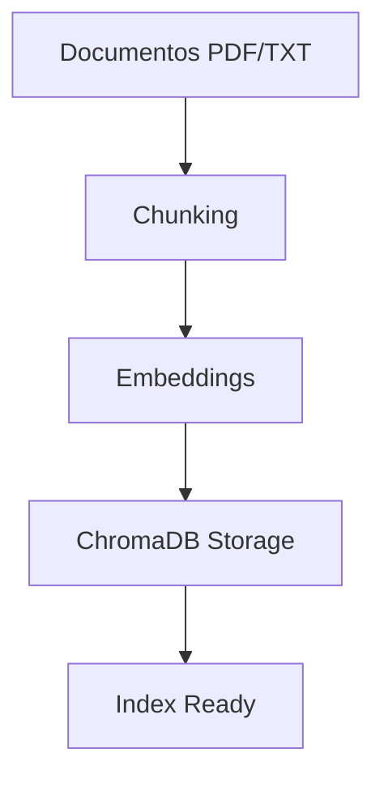
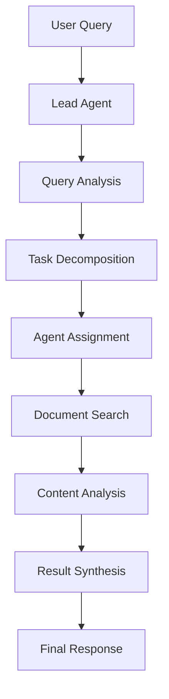

# 🏗️ Arquitetura do Sistema RAG Multi-Agente

## 📋 Visão Geral da Arquitetura

O sistema segue uma arquitetura modular e escalável, separando responsabilidades em componentes bem definidos:

```
┌─────────────────────────────────────────────────────────────┐
│                        API Layer                            │
├─────────────────────────────────────────────────────────────┤
│  FastAPI  │  Authentication  │  Rate Limiting  │  Logging   │
└─────────────────────────────────────────────────────────────┘
                               │
┌─────────────────────────────────────────────────────────────┐
│                   Multi-Agent System                        │
├─────────────────────────────────────────────────────────────┤
│     Lead Agent    │   Search Agent   │   RAG Subagent     │
└─────────────────────────────────────────────────────────────┘
                               │
┌─────────────────────────────────────────────────────────────┐
│                   Core Components                           │
├─────────────────────────────────────────────────────────────┤
│   Memory   │   Reasoning   │   Tools   │   Cache   │  LLM  │
└─────────────────────────────────────────────────────────────┘
                               │
┌─────────────────────────────────────────────────────────────┐
│                   Data Layer                                │
├─────────────────────────────────────────────────────────────┤
│   ChromaDB   │   File System   │   Embeddings   │  Config  │
└─────────────────────────────────────────────────────────────┘
```

## 🎯 Componentes Principais

### 1. **API Layer** (`api_simple.py`, `api_multiagent.py`)

#### FastAPI Application
```python
# Estrutura básica da API
app = FastAPI(
    title="RAG Multi-Agent API",
    description="Sistema avançado de RAG com múltiplos agentes",
    version="1.0.0"
)

# Endpoints principais
@app.post("/search")      # Busca simples
@app.post("/chat")        # Chat interativo  
@app.post("/research")    # Pesquisa multi-agente
@app.get("/health")       # Health check
```

#### Configuração e Middleware
- **CORS**: Configurado para desenvolvimento
- **Rate Limiting**: Proteção contra abuso
- **Logging**: Auditoria completa
- **Error Handling**: Tratamento robusto de erros

### 2. **Multi-Agent System** (`multi-agent-researcher/`)

#### Estrutura de Diretórios
```
multi-agent-researcher/
├── src/researcher/
│   ├── agents/          # Definição dos agentes
│   ├── memory/          # Sistema de memória
│   ├── reasoning/       # Lógica de raciocínio
│   └── tools/           # Ferramentas dos agentes
└── examples/            # Exemplos de uso
```

#### Agentes Implementados

##### **Lead Researcher Agent** (`basic_lead_researcher.py`)
```python
class BasicLeadResearcher(BaseAgent):
    def __init__(self, memory, reasoning, tools):
        self.memory = memory
        self.reasoning = reasoning
        self.tools = tools
    
    def research(self, query: str) -> ResearchResult:
        # Coordena todo o processo de pesquisa
        pass
```

##### **Document Search Agent** (`document_search_agent.py`)
```python
class DocumentSearchAgent(BaseAgent):
    def search_documents(self, query: str) -> List[Document]:
        # Busca semântica na base de conhecimento
        pass
    
    def rank_relevance(self, docs: List[Document]) -> List[Document]:
        # Ranqueia documentos por relevância
        pass
```

##### **Enhanced RAG Subagent** (`enhanced_rag_subagent.py`)
```python
class EnhancedRAGSubagent(BaseAgent):
    def analyze_documents(self, docs: List[Document]) -> Analysis:
        # Análise profunda de documentos
        pass
    
    def generate_insights(self, analysis: Analysis) -> Insights:
        # Gera insights a partir da análise
        pass
```

### 3. **Memory System** (`memory/`)

#### Enhanced Memory (`enhanced_memory.py`)
```python
class EnhancedMemory:
    def __init__(self):
        self.short_term = {}     # Contexto da sessão
        self.long_term = {}      # Conhecimento persistente
        self.episodic = []       # Experiências anteriores
    
    def store_interaction(self, query, response, context):
        # Armazena interação para aprendizado
        pass
    
    def retrieve_relevant(self, query):
        # Recupera contexto relevante
        pass
```

### 4. **Reasoning System** (`reasoning/`)

#### Enhanced ReAct (`enhanced_react_reasoning.py`)
```python
class EnhancedReActReasoning:
    def reason_and_act(self, query: str, context: dict) -> dict:
        """
        Implementa o padrão ReAct:
        - Thought: Análise do problema
        - Action: Ação a ser tomada
        - Observation: Resultado da ação
        """
        pass
```

### 5. **Tools System** (`tools/`)

#### RAG Tools (`rag_tools.py`)
```python
class RAGTools:
    def vector_search(self, query: str) -> List[Document]:
        # Busca vetorial
        pass
    
    def semantic_similarity(self, text1: str, text2: str) -> float:
        # Cálculo de similaridade semântica
        pass
```

## 🔧 Configuração e Setup

### 1. **Configuration Management** (`config.py`)

```python
class Config:
    # ChromaDB Settings
    CHROMA_PERSIST_DIR = "./chroma_db"
    COLLECTION_NAME = "documents"
    
    # LLM Settings
    OPENAI_API_KEY = os.getenv("OPENAI_API_KEY")
    MODEL_NAME = "gpt-4"
    
    # API Settings
    API_HOST = "0.0.0.0"
    API_PORT = 8000
    
    # Agent Settings
    MAX_ITERATIONS = 10
    MEMORY_SIZE = 1000
```

### 2. **Constants** (`constants.py`)

```python
# Prompts para agentes
LEAD_RESEARCHER_PROMPT = """
Você é um pesquisador líder especializado...
"""

DOCUMENT_SEARCH_PROMPT = """
Você é um especialista em busca de documentos...
"""

# Configurações de embedding
EMBEDDING_MODEL = "text-embedding-ada-002"
CHUNK_SIZE = 1000
CHUNK_OVERLAP = 200
```

## 📊 Data Flow

### 1. **Indexação de Documentos**



### 2. **Processamento de Query**



## 🚀 Escalabilidade e Performance

### 1. **Horizontal Scaling**

#### Docker Compose Setup
```yaml
version: '3.8'
services:
  api:
    build: .
    ports:
      - "8000-8010:8000"
    deploy:
      replicas: 3
  
  nginx:
    image: nginx
    volumes:
      - ./nginx.conf:/etc/nginx/nginx.conf
    ports:
      - "80:80"
```

#### Load Balancing (`nginx.conf`)
```nginx
upstream api_backend {
    server api:8000;
    server api:8001;
    server api:8002;
}

server {
    listen 80;
    location / {
        proxy_pass http://api_backend;
    }
}
```

### 2. **Caching Strategy** (`utils/cache.py`)

```python
class CacheManager:
    def __init__(self):
        self.query_cache = {}      # Cache de queries
        self.embedding_cache = {}  # Cache de embeddings
        self.result_cache = {}     # Cache de resultados
    
    def get_cached_result(self, query_hash: str):
        # Recupera resultado do cache
        pass
    
    def cache_result(self, query_hash: str, result: dict):
        # Armazena resultado no cache
        pass
```

### 3. **Resource Management** (`utils/resource_manager.py`)

```python
class ResourceManager:
    def __init__(self):
        self.memory_usage = 0
        self.active_agents = 0
        self.request_queue = []
    
    def allocate_agent(self) -> bool:
        # Controla alocação de agentes
        pass
    
    def monitor_resources(self):
        # Monitora uso de recursos
        pass
```

## 🔒 Segurança e Validação

### 1. **Input Validation** (`utils/validation.py`)

```python
class InputValidator:
    def validate_query(self, query: str) -> bool:
        # Valida entrada do usuário
        pass
    
    def sanitize_input(self, text: str) -> str:
        # Sanitiza entrada
        pass
```

### 2. **Security Recommendations** (`security_recommendations.py`)

- API Key management
- Rate limiting
- Input sanitization
- Output filtering
- Audit logging

## 📈 Monitoring e Métricas

### 1. **Metrics Collection** (`utils/metrics.py`)

```python
class MetricsCollector:
    def track_query_latency(self, duration: float):
        pass
    
    def track_agent_performance(self, agent_id: str, metrics: dict):
        pass
    
    def generate_report(self) -> dict:
        pass
```

### 2. **Health Checks**

```python
@app.get("/health")
def health_check():
    return {
        "status": "healthy",
        "components": {
            "chromadb": check_chromadb(),
            "llm": check_llm_connection(),
            "agents": check_agents_status()
        }
    }
```

## 🔄 Deployment Pipeline

### 1. **Development**
```bash
# Setup local
python install.py
uvicorn api_simple:app --reload

# Tests
python test_api_config.py
./test_all_endpoints.sh
```

### 2. **Production**
```bash
# Docker build
docker-compose up -d

# Health check
curl http://localhost:8000/health

# Monitor logs
docker-compose logs -f
```

## 🎯 Best Practices

### 1. **Code Organization**
- Separação clara de responsabilidades
- Interfaces bem definidas
- Documentação inline
- Testes unitários

### 2. **Performance**
- Cache inteligente
- Lazy loading
- Resource pooling
- Async processing

### 3. **Maintainability**
- Configuração externalizda
- Logging estruturado
- Error handling robusto
- Monitoring contínuo
