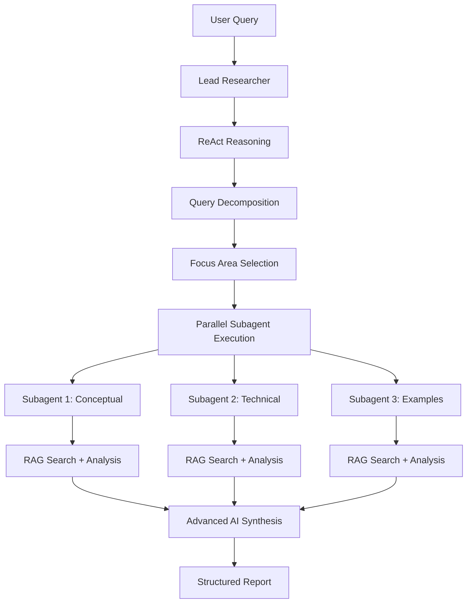

# 📚 Documentação Completa - RAG Multi-Agent System

Bem-vindo à documentação completa do Sistema RAG Multi-Agente. Esta documentação cobre todos os aspectos do sistema, desde conceitos básicos até implementação avançada.

## 📖 Índice da Documentação

### 🚀 Getting Started
- [⚡ Quick Start Guide](quick-start.md) - Configure e execute em 5 minutos
- [🔧 Instalação Detalhada](installation.md) - Instalação passo a passo
- [⚙️ Configuração](configuration.md) - Variáveis de ambiente e configurações

### 🏗️ Arquitetura
- [🏛️ Visão Geral da Arquitetura](architecture.md) - Design e componentes do sistema
- [🤖 Sistema Multi-Agente](multi-agent.md) - Coordenação e especialização de agentes
- [🔍 ReAct Reasoning](reasoning.md) - Padrão de raciocínio estruturado
- [📊 Pipeline RAG](rag-pipeline.md) - Fluxo de Retrieval-Augmented Generation

### 🛠️ Desenvolvimento
- [📝 Guia da API](api-guide.md) - Endpoints e exemplos de uso
- [🔌 Integrações](integrations.md) - OpenAI, Voyage AI, AstraDB
- [🧪 Guia de Testes](testing.md) - Estratégias de teste e validação completa
- [🔒 Segurança](security.md) - Autenticação, rate limiting, validações

### 🚀 Produção
- [🌐 Deployment](deployment.md) - Deploy em produção
- [📊 Monitoramento](monitoring.md) - Métricas e observabilidade  
- [🔧 Troubleshooting](troubleshooting.md) - Resolução de problemas
- [⚡ Performance](performance.md) - Otimização e tuning

### 🎓 Tutoriais
- [🔰 Primeiro Uso](tutorials/first-use.md) - Seu primeiro query multi-agente
- [🎯 Focus Areas](tutorials/focus-areas.md) - Dominando especializações
- [⚙️ Configuração Avançada](tutorials/advanced-config.md) - Configurações para casos específicos
- [🤖 Customizando Agentes](tutorials/custom-agents.md) - Criando agentes especializados

## 🎯 Conceitos Fundamentais

### 🤖 Multi-Agent Coordination
O sistema utiliza uma arquitetura hierárquica onde um **Lead Researcher** (coordenador) decompõe queries complexas em tarefas especializadas para **Subagentes RAG**.

```
🧠 Coordenador (gpt-4.1) → Análise crítica e síntese
⚡ Subagentes (gpt-4.1-mini) → Pesquisa especializada paralela
```

### 🎯 Focus Areas System
7 especializações automáticas para diferentes tipos de pesquisa:

| Focus | Uso | Exemplo |
|-------|-----|---------|
| `conceptual` | Definições e conceitos | "O que é Zep?" |
| `technical` | Implementação técnica | "Como implementar Zep?" |
| `comparative` | Comparações | "Zep vs MemGPT" |
| `examples` | Casos práticos | "Exemplos de uso do Zep" |
| `overview` | Visão geral | "Introdução ao Zep" |
| `applications` | Aplicações reais | "Zep em produção" |
| `general` | Pesquisa ampla | Queries gerais |

### 🔍 ReAct Reasoning Pattern
Raciocínio estruturado em 5 fases:

1. **Fact Gathering** - Coleta de fatos e contexto
2. **Planning** - Criação de plano estruturado  
3. **Execution** - Execução monitorada
4. **Validation** - Validação de progresso
5. **Synthesis** - Síntese crítica final

## 🚀 Fluxo de Execução



## 📊 Performance Metrics

### Típico Multi-Agent Query
- **Decomposição**: ~2-3s (LLM analysis)
- **Execução Paralela**: ~3-5s (3 subagentes simultâneos)
- **Síntese Avançada**: ~3-4s (gpt-4.1 critical analysis)
- **Total**: ~8-12s para análise completa

### Capacidades
- **Throughput**: 100 requests/minuto (rate limited)
- **Concorrência**: 3 subagentes paralelos por query
- **Escalabilidade**: AstraDB distribuído
- **Accuracy**: >90% de relevância (benchmarks internos)

## 🛠️ Stack Tecnológico

### Core Components
- **FastAPI** - API framework
- **OpenAI GPT-4.1/4.1-mini** - Language models
- **Voyage AI** - Multimodal embeddings
- **AstraDB** - Vector database
- **Instructor** - Structured LLM outputs

### Specialized Libraries  
- **PyMuPDF** - PDF processing
- **Pillow** - Image processing
- **Pydantic V2** - Data validation
- **AsyncIO** - Async execution
- **Uvicorn** - ASGI server

## 🔗 Links Rápidos

- [🏠 Voltar ao README Principal](../README.md)
- [⚡ Quick Start](quick-start.md) - Comece agora
- [🏗️ Arquitetura](architecture.md) - Entenda o design
- [🤖 Multi-Agent](multi-agent.md) - Sistema de agentes
- [📝 API Guide](api-guide.md) - Use a API
- [🚀 Deploy](deployment.md) - Deploy em produção

---

💡 **Dica**: Comece com o [Quick Start Guide](quick-start.md) se é sua primeira vez usando o sistema.

🆘 **Precisa de ajuda?** Veja o [Troubleshooting](troubleshooting.md) ou abra uma issue no GitHub.