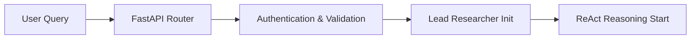
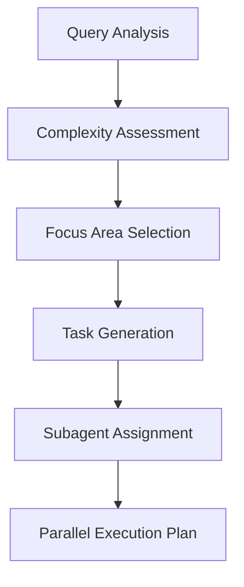
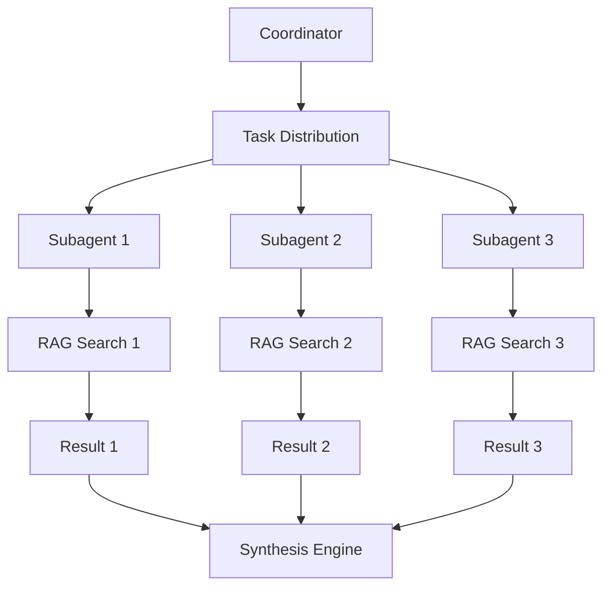
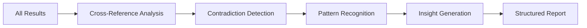

# 🏛️ Arquitetura do Sistema

## 🎯 Visão Geral

O RAG Multi-Agent System é projetado com uma arquitetura hierárquica que combina eficiência e qualidade através de especialização inteligente.

## 🏗️ Componentes Principais

### 1. 🧠 Lead Researcher (Coordenador)
**Modelo**: GPT-4.1 (full model para pensamento crítico)

**Responsabilidades**:
- Query decomposition usando ReAct reasoning
- Seleção inteligente de focus areas
- Coordenação de subagentes
- Síntese crítica avançada dos resultados

**Fluxo de Reasoning**:
```
🔍 Fact Gathering → 📋 Planning → ⚡ Execution → ✅ Validation → 🧠 Synthesis
```

### 2. ⚡ RAG Subagents (Especialistas)
**Modelo**: GPT-4.1-mini (otimizado para eficiência)

**Especializações**:
- **Conceptual Agent**: Definições, conceitos, fundamentos
- **Technical Agent**: Implementação, arquitetura, algoritmos  
- **Comparative Agent**: Comparações, análises, diferenças
- **Examples Agent**: Casos de uso, demonstrações práticas
- **Overview Agent**: Visão geral, introduções amplas
- **Applications Agent**: Aplicações reais, uso empresarial
- **General Agent**: Pesquisa abrangente sem foco específico

### 3. 📊 RAG Pipeline
**Embedding Model**: Voyage Multimodal-3

**Componentes**:
- **Document Indexer**: Processamento de PDFs com extração de texto e imagens
- **Vector Store**: AstraDB para busca semântica distribuída
- **Retrieval Engine**: Busca + re-ranking inteligente
- **Multimodal Processing**: Suporte a texto + imagens

## 🔄 Fluxo de Execução Detalhado

### Fase 1: Recepção e Análise


### Fase 2: Decomposição Inteligente


### Fase 3: Execução Paralela


### Fase 4: Síntese Avançada


## 🎯 Focus Areas System

### Arquitetura de Especialização

```python
# Mapping inteligente de query para focus areas
FOCUS_MAPPING = {
    "conceptual": {
        "patterns": ["what is", "define", "concept", "meaning"],
        "query_adjustment": lambda q: f"definition concepts fundamentals {q}",
        "processing": ConceptualProcessor
    },
    "technical": {
        "patterns": ["how to", "implement", "architecture"],
        "query_adjustment": lambda q: f"technical implementation {q}",
        "processing": TechnicalProcessor
    },
    # ... outros focus areas
}
```

### Seleção Automática
1. **Análise Linguística**: Detecção de padrões na query
2. **Context Assessment**: Avaliação do contexto e objetivos
3. **Complementarity**: Seleção de areas complementares
4. **Optimization**: Minimização de sobreposição

## 📊 Data Flow Architecture

### 1. Document Ingestion
```
PDF → PyMuPDF → Text + Images → Chunking → Voyage Embeddings → AstraDB
```

### 2. Query Processing  
```
User Query → Preprocessing → Focus Selection → Parallel Search → Synthesis
```

### 3. Response Generation
```
Raw Results → Cross-Analysis → Critical Synthesis → Structured Output
```

## 🏗️ System Layers

### Layer 1: API Gateway
- **FastAPI** routes
- **Authentication** (Bearer tokens)
- **Rate limiting** (100/min)
- **Request validation** (Pydantic)
- **CORS** handling

### Layer 2: Orchestration
- **Lead Researcher** coordination
- **Multi-agent** task distribution
- **ReAct reasoning** engine
- **Error handling** and fallbacks

### Layer 3: Execution
- **Parallel subagents** 
- **RAG search** engines
- **Document processing**
- **Result aggregation**

### Layer 4: Data
- **AstraDB** vector storage
- **File system** for images
- **Memory caching**
- **Metadata storage**

## ⚡ Performance Architecture

### Parallel Execution Model
```python
async def execute_parallel(tasks):
    """Execução paralela otimizada"""
    coroutines = [
        asyncio.wait_for(
            subagent.run(task), 
            timeout=300  # 5min timeout
        ) 
        for subagent, task in zip(subagents, tasks)
    ]
    return await asyncio.gather(*coroutines, return_exceptions=True)
```

### Memory Management
- **L1 Cache**: Results imediatos (1000 entries)
- **L2 Cache**: Embeddings (5000 entries)  
- **Global Cache**: Responses (TTL 1h)
- **Memory Sharding**: 4 shards por agent_hash

### Connection Pooling
- **HTTP**: Persistent connections para OpenAI/Voyage
- **Database**: Connection pool para AstraDB
- **Async**: Non-blocking I/O throughout

## 🔒 Security Architecture

### Multi-Layer Security
1. **API Level**: Bearer authentication, rate limiting
2. **Input Level**: SSRF/XSS validation, size limits
3. **Processing Level**: Timeout controls, resource limits
4. **Data Level**: Encrypted connections, secure storage

### Validation Pipeline
```python
def validate_request(request):
    """Pipeline de validação completa"""
    validate_authentication(request)
    validate_rate_limits(request)
    validate_input_safety(request.data)
    validate_resource_limits(request)
```

## 🔄 State Management

### Agent State Tracking
```python
class AgentState(Enum):
    IDLE = "idle"
    PLANNING = "planning" 
    EXECUTING = "executing"
    COMPLETED = "completed"
    FAILED = "failed"
```

### Reasoning State
- **History tracking**: Todos os steps de reasoning
- **Progress validation**: Detecção de loops
- **Confidence scoring**: Métrica de confiança
- **Error recovery**: Fallback strategies

## 📈 Scalability Design

### Horizontal Scaling
- **Stateless design**: No session state
- **Load balancing**: Multiple API instances
- **Database sharding**: AstraDB distributed
- **Caching layers**: Redis for high-frequency data

### Vertical Optimization
- **Async processing**: Non-blocking operations
- **Memory efficiency**: Streaming where possible
- **CPU optimization**: Parallel processing
- **I/O optimization**: Connection pooling

## 🔧 Configuration Architecture

### Environment-Driven Config
```python
@dataclass
class SystemConfig:
    # AI Models
    llm_model: str = os.getenv('OPENAI_MODEL', 'gpt-4.1-mini')
    coordinator_model: str = os.getenv('COORDINATOR_MODEL', 'gpt-4.1')
    
    # Performance
    max_subagents: int = get_env_int('MAX_SUBAGENTS', 3)
    parallel_execution: bool = get_env_bool('PARALLEL_EXECUTION', True)
    
    # Security  
    production_mode: bool = get_env_bool('PRODUCTION_MODE', True)
    enable_rate_limiting: bool = get_env_bool('ENABLE_RATE_LIMITING', True)
```

### Hierarchical Configs
- **Global**: System-wide defaults
- **Environment**: Environment-specific overrides
- **Runtime**: Dynamic configuration updates

---

## 📚 Links Relacionados

- [🤖 Sistema Multi-Agente](multi-agent.md) - Detalhes dos agentes
- [🔍 ReAct Reasoning](reasoning.md) - Padrão de raciocínio
- [📊 Pipeline RAG](rag-pipeline.md) - Fluxo de retrieval
- [⚙️ Configuração](configuration.md) - Setup detalhado
- [🚀 Performance](performance.md) - Otimizações